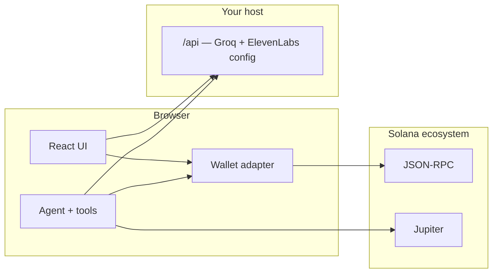

<div align="center">

# VOCA

### Talk to your wallet. It talks back.

**Voice-first Solana assistant** · real balances, quotes, swaps & sends · your keys, your chain

[](https://solana.com)
[](https://jup.ag)
[](https://tanstack.com/start)

<br/>

</div>

> Crypto wasn’t built for thumbs-only typing at a stoplight—or for memorizing forty-character addresses. **VOCA** is the layer that sits *between* you and the chain: you say what you want, get a short answer in plain language (and in your ears), then **you** approve what actually moves.

---

## At a glance

| | |
|:---|:---|
| **Speak or type** | Same brain for mic and keyboard—no split personality. |
| **Live portfolio** | SOL & SPL balances, USD where Jupiter has a price. |
| **Swaps & sends** | Quote first, confirm in human words, execute only after you say so. |
| **Stays with you** | Chat persists; agent context survives a refresh. |
| **Optional on-chain** | Anchor program + IDL sync for logging & limits when you turn it on. |

---

## The itch we’re scratching

Most wallets still feel like **spreadsheets with extra steps**. You’re expected to read dense UI, copy long strings, and mentally juggle mints and networks—on a phone, at night, while distracted.

VOCA is built for a different rhythm:

1. **Intent** — “What do I have?” “Swap half a SOL to USDC.” “Send five bucks in USDC to this address.”
2. **Clarity** — Replies are **short** on purpose; this product is tuned for **listening**, not scrolling.
3. **Control** — Nothing hits Solana until you’ve seen the path and **explicitly** gone ahead.

---

## What you can do today

### Voice loop

Push-to-talk → transcription → streaming reply → spoken audio. **Groq** runs chat and Whisper; **ElevenLabs** gives the reply a voice. Provider keys live in **server routes**, not in client bundles.

### Wallet-native money moves

This is not a mocked “chat only” shell:

- **Balances** — your RPC, SOL + SPL token accounts.
- **Prices** — Jupiter, mint-level **USD**.
- **Swaps** — Jupiter quote → swap transaction → **you sign** with Phantom / Solflare.
- **Sends** — SOL and SPL transfers on the same signing path.

### Conversation memory

Transcript **persists locally**; after a refresh, agent context is **rehydrated** from that history. **Clear** resets UI, storage, and the model session together.

### Optional on-chain layer (Anchor)

The **`contracts/`** workspace is the real program; **`npm run sync`** drops the **IDL** into the frontend. Flip on `VITE_VOCA_CONFIG_AUTHORITY` and `VITE_VOCA_AGENT_NONCE` only when you want interaction logging and agent PDAs—**everything above works without them.**

---

## Solana integration (technical)

VOCA runs **in the browser** against Solana using:

- **`@solana/wallet-adapter-react`** — `ConnectionProvider` + Phantom / Solflare; user signs everything.
- **`@solana/web3.js`** & **`@solana/spl-token`** — RPC reads, SOL/SPL sends, transaction building.
- **Jupiter** — Price API for USD; quote/swap API for routed swaps into a **versioned transaction** you approve.
- **`@coral-xyz/anchor`** — optional: program client from synced **IDL**, program id from IDL or `VITE_VOCA_PROGRAM_ID`.

**RPC** resolves from `VITE_SOLANA_RPC_URL` / `SOLANA_RPC_URL`, optional **local validator** (`VITE_USE_LOCAL_SOLANA=1`), otherwise **public devnet**. Cluster label in the UI reflects what you’re connected to.

Server routes (`/api/chat`, `/api/stt`, `/api/voice-config`) handle **AI and voice only**—they never custody keys or sign for you.

---

## Architecture



---

## Repo layout

```
VOCA/
├── frontend/          # TanStack Start, Vite, all UI + /api routes
├── contracts/         # Anchor program (IDL → synced into frontend)
├── scripts/sync.mjs   # IDL copy after `anchor build`
└── README.md
```

Handy scripts from the **repo root**:

| Command | What it does |
|:--------|:-------------|
| `npm run dev` | Dev server (`frontend`) |
| `npm run build` | Production build (Cloudflare-shaped by default) |
| `npm run ci` | Lint + build (frontend) |
| `npm run sync` | Refresh IDL in `frontend` after building contracts |

---

## Run locally

```bash
npm install --prefix frontend
cd frontend && npm run env:init
```

Edit **`frontend/.env`** (start from **`.env.example`**). Minimum for the full experience:

| Variable | Role |
|:---------|:-----|
| `GROQ_API_KEY` | Chat streaming + speech-to-text |
| `ELEVENLABS_API_KEY` | Text-to-speech |
| `ELEVENLABS_VOICE_ID` | Voice selection |

Then:

```bash
cd .. && npm run dev
```

IDL sync after `anchor build` in `contracts/`:

```bash
npm run sync
```

---

## Deploy

### Vercel

Vercel sets `VERCEL=1` during build so the app uses **Nitro** (TanStack’s supported path there). **Root directory must be `frontend`** (so `npm install` runs in the folder that contains `vite` and `package-lock.json`). Add the same env vars as in `.env.example`. Build tools (`vite`, `nitro`, `@vitejs/plugin-react`) are listed under **`dependencies`** so installs that skip devDependencies still build. Local check:

```bash
cd frontend && npm run build:vercel
```

### Cloudflare / Wrangler

Default **`npm run build`** in `frontend` targets the **Cloudflare** Vite plugin and `dist/server` worker output—use your existing Wrangler flow.

---

## Safety

VOCA can move **real assets** on whatever cluster your RPC points to. Use **devnet** for experiments; on **mainnet**, read every confirmation. Production use deserves audits, legal review, and explicit risk controls—not just a slick UI.

---

## Stack

TanStack Start · React · Vite · Tailwind · Zustand · Solana web3.js · Jupiter · Groq · ElevenLabs · Anchor (optional)

---

<div align="center">

**VOCA** — *less terminal, more conversation.*

</div>
