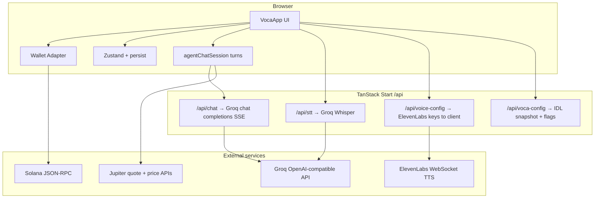

# VOCA

**Voice-operated crypto assistant on Solana.**  
Talk to your wallet: check balances and prices, quote swaps, send tokens, and hear answers back — without treating the blockchain like a spreadsheet.

VOCA is built as a **hackathon-grade demo** that shows how **natural language + voice** can sit on top of **real wallet flows** (Jupiter, SPL transfers) with a **tool-using LLM** that stays concise enough for text-to-speech. This repository is the full stack: React UI, TanStack Start API routes, and an optional **Anchor** program for agent registration and on-chain interaction logging.

---

## Why this exists (the pitch)

Most crypto products still assume users will **read** dense UIs, **copy** long addresses, and **reason** about slippage and mints in silence. VOCA argues for a different default: **say what you want**, get a **short spoken confirmation**, then **approve** — especially on mobile, in the car, or for anyone who finds wallet chrome intimidating.

**What the demo proves**

- **Voice in, voice out**: push-to-talk → speech-to-text → agent → streamed reply → ElevenLabs playback.
- **Same brain for type and talk**: one shared agent session so the mic and the text box never disagree about context.
- **Real Solana operations**: balances from RPC, USD context from Jupiter price APIs, swaps and sends through Jupiter quotes and `@solana/web3.js` transfers — not a mocked “chat only” toy.
- **Safety-shaped UX**: the model is instructed to **quote first** (`confirmed: false`) and only execute after **explicit** user approval (`confirmed: true`).
- **Persistence**: conversation survives refresh; Groq tool history is **rehydrated** from saved messages so the agent still “remembers” after reload.
- **Optional on-chain story**: an Anchor program can register **agents** with spending limits and **log** swap/send metadata for auditability (best-effort from the client when env is configured).

---

## What you see in the demo

| Surface | What it does |
|--------|----------------|
| **Portfolio hero** | High-level view of connected wallet value and narrative “hero” copy driven by live data. |
| **Chain strip** | Shows which cluster/RPC flavor you are on (devnet vs custom RPC). |
| **Token grid** | Visual token cards with prices and context (Jupiter-backed where applicable). |
| **Conversation** | Scrollable transcript; messages persist locally; **Clear** wipes UI + storage + agent memory. |
| **Mic** | Records audio → `/api/stt` (Groq Whisper) → same agent pipeline as text. |
| **Text input** | Type if you prefer not to speak; shares the identical agent session. |
| **Wallet button** | Standard Solana wallet-adapter multi-wallet connect. |

Footer tagline in the app sums the integration story: **devnet · Jupiter · Groq · ElevenLabs**.

---

## User journey (how to narrate the live demo)

1. **Connect wallet** — “This is a real Phantom / Backpack / etc. session against Solana RPC.”
2. **Ask for balance** — e.g. “What am I holding?” The agent calls **`get_balance`**, enriches with USD where prices exist, and answers in **one or two short sentences** (optimized for ears, not eyes).
3. **Price check** — “What’s JUP at?” → **`get_token_price`**.
4. **Swap (quoted, not rushed)** — “Swap half a SOL to USDC” → agent uses **`swap_tokens`** with `confirmed: false`, reads amounts aloud, waits for **“yes / go ahead”** before `confirmed: true` execution.
5. **Send (multi-turn)** — User says amount and token; **next message** might be **only** a base58 address. The system prompt tells the model to **merge** that address with the ongoing send intent instead of asking a generic follow-up. Same quote-then-approve pattern as swaps.
6. **Voice round-trip** — Hold mic, speak, hear the reply. Mention that STT and chat both go through **Groq** (fast iteration, one vendor key story) while TTS is **ElevenLabs** for natural prosody.
7. **Refresh the page** — Transcript returns; follow-up still works because **`agent-chat-session`** was rebuilt from persisted messages.

If something fails (RPC, simulation, user reject), the agent is prompted to explain **simply** and offer retry — good demo resilience.

---

## Architecture (high level)



**Key idea:** API routes hold **secrets** (`GROQ_API_KEY`, `ELEVENLABS_*`). The browser never needs raw Groq keys for chat/STT; it posts audio or consumes streamed tokens. ElevenLabs is initialized from **`/api/voice-config`** so the demo can keep the ElevenLabs key server-side as well.

---

## AI agent design

| Piece | Implementation |
|-------|------------------|
| **Model** | `llama-3.3-70b-versatile` via Groq OpenAI-compatible **`/v1/chat/completions`**, streaming SSE (`frontend/src/routes/api/chat.ts`). |
| **Tools** | Native function calling: `get_balance`, `get_token_price`, `swap_tokens`, `send_token` — definitions in `frontend/src/lib/ai/tools.ts`. |
| **System behavior** | `frontend/src/lib/ai/system-prompt.ts`: voice-first brevity, multi-turn autonomy (merge address-only follow-ups with pending sends), default **USDC** for bare dollar amounts unless user said SOL, **no** leaked tool XML in user-visible text. |
| **Client tool loop** | `useVocaAgent` streams assistant text, executes tool calls against wallet + connection + Jupiter helpers, pushes tool results back into the model for up to several rounds before finishing. |
| **Sanitization** | `chat-sanitize` strips accidental tool markup from streams and TTS so the demo never reads angle-bracket XML aloud. |

This is deliberately **opinionated**: the product is not “a chatbot that knows about crypto,” it is a **transaction-aware voice shell** with guardrails.

---

## Solana and DeFi integration

- **Cluster / RPC**: Configurable via `VITE_SOLANA_RPC_URL` and related env; defaults suit **devnet** demos (`frontend/.env.example`).
- **Tokens**: Symbol → mint resolution in `frontend/src/lib/tokens.ts` with optional mainnet mint pack for richer symbol coverage when enabled.
- **Prices**: Jupiter **Price API v3** for USD (used for portfolio and spoken amounts).
- **Swaps**: Jupiter quote path (v6 quote API in code) → user-approved execution path in `useVocaAgent` / `jupiter.ts`.
- **Transfers**: SPL + SOL sends via `buildAndSendTransfer` and associated helpers.

---

## On-chain program (optional narrative)

Under `contracts/` lives an **Anchor** workspace program (see `programs/workspace/src/lib.rs`) that implements a **configurable platform** model:

- **`initialize_config` / `update_config`**: fee basis points, treasury, caps, pause flag.
- **`register_agent`**: per-wallet **agents** with spending limits, daily limits, and metadata (name, personality hash).
- **`log_interaction`**: append-only style logging of interaction types and hashed descriptions, with **limit enforcement** against the agent’s spending and daily caps.

The **frontend** can optionally call into this program after swaps/sends (`tryLogVocaSwap`, `tryLogVocaSend` in `frontend/src/lib/voca/interaction-log.ts`) when **`VITE_VOCA_PROGRAM_ID`** and related env are set and the on-chain agent is active. For a pitch, this is the **“not just off-chain logs”** slide: optional **verifiable** trail and agent economics.

**Program ID** in source should match your deployed ID; **`npm run sync`** copies the built **IDL** into the frontend so TypeScript and Anchor client code stay aligned.

---

## Repository layout

| Path | Role |
|------|------|
| `frontend/` | TanStack Router + Start, Vite 7, React 19, Tailwind/Radix UI, all `/api/*` routes, wallet + agent + voice. |
| `contracts/` | Anchor program; `target/idl/*.json` is the sync source for the TS client. |
| `scripts/sync.mjs` | Copies IDL into `frontend` for a single source of truth after `anchor build`. |
| Root `package.json` | Convenience scripts: `dev`, `build`, `sync`, `sync:all`, `build:contracts`. |

---

## Quick start (for judges or teammates)

```bash
git clone <repo-url> && cd VOCA
npm install --prefix frontend
cd frontend && npm run env:init
```

Edit **`frontend/.env`** (see **`frontend/.env.example`**). Minimum for the full voice + agent demo:

- `GROQ_API_KEY` — chat + streaming + Whisper STT  
- `ELEVENLABS_API_KEY` + `ELEVENLABS_VOICE_ID` — spoken replies  

Then from repo root:

```bash
npm run dev
```

Or work only in `frontend/` with `npm run dev` / `npm run build`.

**IDL sync** (after `anchor build` in `contracts/`):

```bash
npm run sync
```

**Full chain**: `npm run sync:all` runs `anchor build` then sync.

---

## Environment (why `.env` is shaped this way)

`vite dev` loads **`frontend/.env`** into `import.meta.env` for **`VITE_*`** keys the browser needs (RPC, optional program IDs). The same file is **merged into `process.env`** during dev so **server handlers** can read `GROQ_*` and `ELEVENLABS_*` without duplicating every secret behind a `VITE_` prefix. Production / Cloudflare: mirror these variables in the host’s secret mechanism (Wrangler secrets, etc.) as you would for any edge worker.

---

## Chat persistence and shared agent state

- **UI messages** persist with **Zustand `persist`**, `localStorage` key **`voca-chat-v1`**, `skipHydration: true` so SSR/hydration do not flash wrong state.
- **`ClientGate`** runs **`persist.rehydrate()`** on mount, then **`agentChatSession.hydrateFromUiMessages(...)`** so the **Groq message list** matches the transcript after reload.
- **`useVocaAgent`** (mic + text) both append to **`agentChatSession.turns`** — fixing the classic bug where two hooks meant two different “brains.”
- **Clear** in the transcript calls **`clear()`** on the store, which resets messages, status, input level, and **`agentChatSession.reset()`**.

---

## Contracts: build and test

With [Anchor](https://www.anchor-lang.com/) and Rust installed:

```bash
cd contracts && anchor build && anchor test
```

From repo root:

```bash
npm run build:contracts
```

CI sandboxes often omit Anchor; run these locally when demonstrating program features.

---

## Tech stack (checklist for slides)

| Layer | Choices |
|-------|---------|
| **App framework** | TanStack Start, TanStack Router, file-based routes |
| **Bundler / SSR** | Vite 7, Cloudflare adapter in toolchain |
| **UI** | React 19, Tailwind CSS, Radix, Framer Motion, Sonner toasts |
| **State** | Zustand + persist |
| **Wallet** | `@solana/wallet-adapter-react` |
| **On-chain client** | Anchor TS + IDL synced from `contracts` |
| **LLM + STT** | Groq (`llama-3.3-70b-versatile`, `whisper-large-v3-turbo`) |
| **TTS** | ElevenLabs (WebSocket client in app) |
| **Liquidity / prices** | Jupiter |

---

## Roadmap ideas (credibly “what’s next”)

- **Mainnet-hardening**: stricter confirmation UX, simulation previews, priority fee hints.
- **Policy engine**: translate on-chain agent limits into UI-enforced caps before `confirmed: true`.
- **Multi-language STT/TTS** and locale-aware number reading.
- **Mobile PWA** install and background mic consent flows.
- **Delegated / session keys** where product and legal allow — not implied by current demo.

---

## Disclaimer

VOCA is **demo software**. It moves real funds on whatever cluster you point it at. Do not use user mainnet savings as a stunt without audits, legal review, and a production security program. The README is accurate to the **intent** of the codebase; always verify behavior on your own RPC and keys before presenting externally.

---

## License and attribution

Project-specific license: see repository **LICENSE** if present; otherwise treat as private demo code until you add one.

When pitching, name the **integrations** you depend on: **Solana**, **Jupiter**, **Groq**, **ElevenLabs**, and **Anchor** — they make the story credible.
